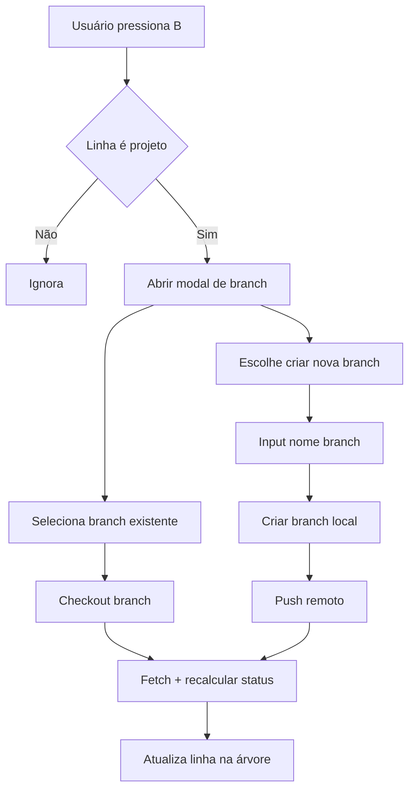

# Plano - Seleção/Criação de Branch na TUI

## Objetivo
Permitir escolher/criar branch diretamente na árvore de repositórios, abrindo uma modal (atalho B) apenas para projetos, listando branches locais. Se o usuário informar uma branch inexistente, criar branch local e **push** para remoto. Ao fechar a modal, atualizar a linha selecionada com a nova branch e recalcular status (sync/ahead/behind) com **fetch** local.

## Contexto atual relevante
- A modal atual de parâmetros é renderizada no layout principal da TUI via [`src/modules/git/tui/layout.tsx`](../src/modules/git/tui/layout.tsx).
- A navegação da árvore e atalhos estão em [`src/modules/git/tui.app.tsx`](../src/modules/git/tui.app.tsx).
- Estados de modal são controlados em [`src/modules/git/tui/layoutContext.ts`](../src/modules/git/tui/layoutContext.ts).
- Tipos de nós e status em [`src/modules/git/types.ts`](../src/modules/git/types.ts).
- Strings de UI em [`src/i18n/pt_BR.ts`](../src/i18n/pt_BR.ts) e [`src/i18n/en_US.ts`](../src/i18n/en_US.ts).

## Estratégia de implementação
1. **Estado de modal com tipo**
   - Evoluir o estado de modal para suportar múltiplos tipos (parâmetros vs branch), mantendo compatibilidade com o atalho P.
   - Sugestão: substituir boolean por enum/union (`modal: null | parameters | branch`), expondo `openModal(type)` e `closeModal()`.
   - Arquivo: [`src/modules/git/tui/layoutContext.ts`](../src/modules/git/tui/layoutContext.ts).

2. **Nova modal de branch (UI)**
   - Criar componente [`src/modules/git/tui/components/BranchModal.tsx`](../src/modules/git/tui/components/BranchModal.tsx).
   - Mesmo padrão visual da modal de parâmetros (bordas, header e hint).
   - Recursos:
     - Lista de branches (scroll com ↑/↓ PgUp/PgDn).
     - Opção “Criar nova branch” que abre campo de input.
     - Enter confirma seleção/criação; Esc cancela.

3. **Serviço Git para branches (local)**
   - Implementar funções para:
     - Listar branches locais (`git branch --format`).
     - Criar branch (`git checkout -b <name>`).
     - Push remoto (`git push -u origin <name>`).
     - Obter status atualizado (`fetch` + ahead/behind).
   - Local sugerido: módulo novo (ex.: `src/modules/git/core/gitBranchService.ts`) ou expansão em [`src/modules/git/gitCommand.ts`](../src/modules/git/gitCommand.ts) / [`src/modules/git/core/gitSyncService.ts`](../src/modules/git/core/gitSyncService.ts).

4. **Integração com a árvore**
   - Atalho **B** em [`src/modules/git/tui.app.tsx`](../src/modules/git/tui.app.tsx):
     - Abrir modal apenas se o item selecionado for `project`.
     - Passar `localPath` do projeto (pode exigir enriquecer `GitLabTreeNode` com `localPath`).
   - Ao confirmar na modal:
     - Executar checkout da branch escolhida.
     - Se nova, criar branch e push remoto.
     - Recalcular status (fetch) e atualizar `node.status`.
     - Forçar re-render (`setVersion`).

5. **i18n**
   - Adicionar chaves para título, hint, estados vazios, rótulos de criação e erros nas traduções:
     - [`src/i18n/pt_BR.ts`](../src/i18n/pt_BR.ts)
     - [`src/i18n/en_US.ts`](../src/i18n/en_US.ts)

6. **Testes**
   - **Unitários**: novo teste para serviço de branch (list/criar/push), em `tests/`.
   - **TUI**: simular abertura via atalho **B** e confirmação (onde viável), validando atualização de status/branch em `tests/tui_*`.

## Fluxo (Mermaid)

## Riscos e validações
- Garantir que o repositório exista localmente antes de listar branches.
- Tratar erro em push remoto (ex.: falta de permissões).
- Sincronizar atualização da árvore sem quebrar a navegação.
