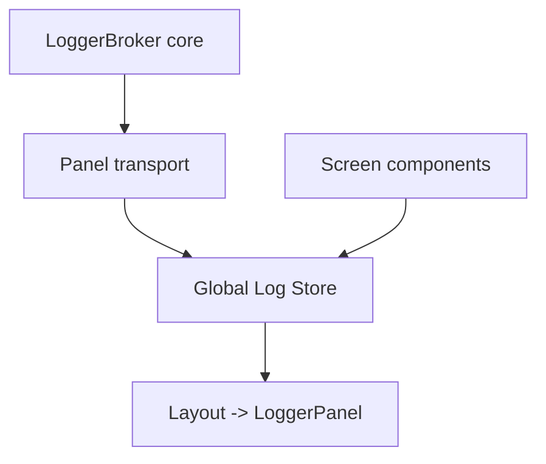

# Plano de correção - Persistência global do painel de log

## Contexto
- O painel de log está sendo recriado por tela porque cada tela mantém seu próprio estado local de logs em [`renderMenu()`](src/modules/git/tui/menu.app.tsx:57), em prompts de sessão dentro de [`createTuiSession()`](src/modules/git/tuiSession.tsx:69) e na árvore em [`renderRepositoryTree()`](src/modules/git/tui.app.tsx:212).
- O objetivo é um log único, persistente e compartilhado por toda a TUI, unificando logs de UI e do core via [`LoggerBroker`](src/modules/git/core/loggerBroker.ts:26).

## Estratégia
1. **Criar um Log Store global para TUI** (módulo singleton em memória) com:
   - `append(message, level)` e `appendEntry(entry)`.
   - `getEntries()` para leitura inicial.
   - `subscribe(listener)` para notificar atualizações.
2. **Conectar o core** adicionando um transport que empurre entradas do [`LoggerBroker`](src/modules/git/core/loggerBroker.ts:26) para o Log Store.
3. **Substituir estados locais de logs** nas telas por um hook que consome o Log Store e renderiza o painel de log global.
4. **Adicionar logs de UI** (mensagens de menu, prompts e ações) via `append` no Log Store em vez de `useState` local.
5. **Atualizar testes e documentação** para refletir persistência global.

## Fluxo proposto

## Pontos de integração previstos
- Substituir `useState<LogEntry[]>` em:
  - [`renderMenu()`](src/modules/git/tui/menu.app.tsx:57)
  - prompts de sessão em [`createTuiSession()`](src/modules/git/tuiSession.tsx:69)
  - [`renderRepositoryTree()`](src/modules/git/tui.app.tsx:212)
- Criar módulo de store em `src/modules/git/tui/logStore.ts` (novo), exposto via hook `useLogStore()`.
- Registrar transport no bootstrap do TUI (ex.: `tui.app` ou `cli`), garantindo que não duplica em hot reload.

## Ajustes em testes e docs
- Validar persistência no fluxo de troca de telas (`menu` -> `prompts` -> `árvore`).
- Revisar testes TUI em [`tests/tui_menu_dashboard_test.ts`](tests/tui_menu_dashboard_test.ts:1), [`tests/tui_render_test.ts`](tests/tui_render_test.ts:1) e similares.
- Documentar correção em [`docs/bugs-conhecidos.md`](docs/bugs-conhecidos.md:1).
